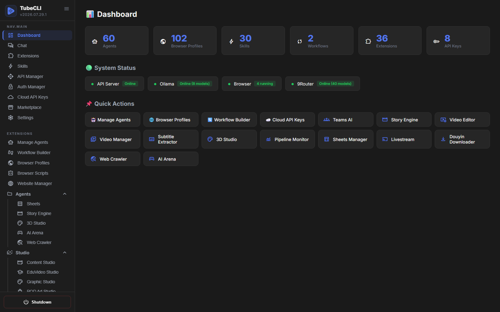

# TubeCLI — Self-Hosted AI Agent Team That Deploys Websites, Automates Browsers, and Translates Video

**Coding agents write code. This one runs the operations — on your machine, with your keys, for your clients.**

<p align="center">
  <b>English</b> |
  <a href="READMEs/README_zh-CN.md">简体中文</a> |
  <a href="READMEs/README_zh-TW.md">繁體中文</a> |
  <a href="READMEs/README_ja.md">日本語</a> |
  <a href="READMEs/README_ko.md">한국어</a> |
  <a href="READMEs/README_es.md">Español</a> |
  <a href="READMEs/README_tr.md">Türkçe</a> |
  <a href="READMEs/README_ru.md">Русский</a> |
  <a href="READMEs/README_vi.md">Tiếng Việt</a>
</p>

<p align="center">
  <a href="https://github.com/tubecreate/tubecli/stargazers"></a>
  <a href="https://github.com/tubecreate/tubecli/blob/main/LICENSE"></a>
  
  
  
  
</p>

**TubeCLI is a self-hosted, open-source AI agent team that executes real operational work end to end.** It is not a chat wrapper, and it is not a framework you have to code your agents into. You describe the job in plain language — from the CLI, a web dashboard, or Telegram — and an agent team carries it out with real tools against your own infrastructure.

## What it actually does

### Deploy a real website from one sentence

Say it in chat or Telegram — *"create a website called coffee-shop using the coffee-machine template"* — and the website agent runs the entire chain against **your own** Cloudflare account, streaming every step to a live log:

```
[1/9] git clone --depth=1 -- <template>            → clone
[2/9] npm install
[3/9] wrangler d1 create + wrangler r2 bucket create
[4/9] wrangler d1 execute schema.sql --remote       → real remote database
[5/9] write wrangler.toml  (D1 + R2 bindings)
[6/9] npx @opennextjs/cloudflare build
[7/9] npx wrangler deploy                          → https://<site>.workers.dev
[8/9] seed the admin password you chose
[9/9] DEPLOY_RESULT {url, adminSeeded}
```

Every step is in [`deploy_runner.js`](tubecli/extensions/website_manager/deploy_runner.js) — read it before you trust it. **It is not one-click:** it needs valid Cloudflare credentials and D1 quota, and when a step fails it stops and names the step in the log rather than reporting a half-built site as finished.

### Subtitle, translate and dub a video

```bash
tubecli skill run "Analyze Channel" --input "https://www.youtube.com/@channel"
tubecli skill run "Extract Subtitle" --input "<video-url-or-path>"
tubecli skill run "Translate Subtitle" --input "<job-id>"
```

Three interchangeable extraction engines — local Whisper, Gemini, or YouTube captions — exporting **SRT / JSON / VTT / ASS**. Dubbing has six TTS engines. Burn-in and hardsub removal (ffmpeg `delogo`/blur/pixel/fill with OpenCV region detection) are implemented and reviewable, but treat them as experimental.

### Keep a human in front of anything irreversible

An agent proposing something destructive does not just do it:

```bash
codex                  # list what is waiting
codex 3                # inspect task 3 — goal, assignee, step timeline
approve 3              # or:  reject 3
```

Tasks the AI creates land in `pending_approval` and wait. Deploying, publishing and deleting all pass through that gate, and every task keeps an append-only JSONL audit trail with step timings and retry counters.

### Run it from wherever you are

The same pipeline backs all three surfaces — CLI, web dashboard, and a Telegram bot. Send a link to the bot and it replies with the finished file; approve a task from your phone; watch a deploy log stream in the browser.

**Models:** every LLM call runs on local [Ollama](https://ollama.com) — no API key, no per-token cost — or on Gemini, OpenAI, Claude, DeepSeek, Grok and OpenRouter with your own keys. Critical paths use zero-token fast paths that never call a model at all.

**Also included:** WordPress publishing over the WP REST API, web crawling and change watching, video download, Google Sheets and Calendar, POD/graphic/content studios, and livestream restreaming.

**What you get on `git clone`:** the agent runtime plus **17 built-in extensions** (`website_manager`, `browser`, `browser_scripts`, `codex`, `video_studio`, `multi_agents`, `cloud_api`, `market`, `ollama_manager`, `webui`, `auth_manager`, `calendar_manager`, `chat`, `douyin_downloader`, `file_manager`, `studio3d`, `universal_tracker`). A further **19 studios** — web crawler, video downloader, subtitle extractor, TTS, content/POD/graphic studio, livestream, sheets and more — install in one click from the in-dashboard marketplace.

*v2026.07.31.1 · Python 3.10+ / FastAPI / Vue / Three.js · MIT*

---

## The dashboard

All of it is also driveable from a browser at `localhost:5295/dashboard` — agents, browser profiles, skills, workflows, extensions and API keys in one place, with local Ollama and browser status live in the header and every installed studio in the sidebar.



---

## Why people pick it

- **"It generated a scaffold, not a website."** The deploy runner executes nine real steps against *your* Cloudflare account and does not stop until a URL answers. You can read every step in the repo. See the caveat above — it is real, not magic.
- **"The framework is free, but I'm not allowed to resell it."** TubeCLI is MIT: multi-tenant deployment, white-labelling and reselling are all permitted. For contrast, n8n's Sustainable Use License forbids reselling it as a hosted service, and Dify's modified Apache license forbids operating a multi-tenant environment and forbids removing their logo. *(CrewAI, LangGraph and OpenHands are MIT too — this argument does not apply to them.)*
- **"My agent burned tokens deciding what to do."** Common flows are routed by zero-token fast paths — deterministic intent matching that never calls a model. The LLM is used where judgement is actually needed.
- **"I don't want my clients' credentials in someone else's cloud."** Everything runs on your hardware. Your keys stay in your own `data/` directory, and with local Ollama the system needs no external API at all.
- **"An agent did something irreversible."** The Codex queue gates it: AI-created tasks land in `pending_approval` and wait for a human before anything irreversible runs — deploy, publish, delete. Every task carries an append-only JSONL audit trail with step timings and retry counters, and a running deploy can be cancelled mid-flight.

## 🌟 Key Features

The system has evolved into a full-fledged 12-subsystem architecture:

- 💬 **Chat** — A unified conversation interface for the whole system. Multi-session threads with durable history, an agent picker (or automatic routing to the right specialist), and markdown rendering. Every turn runs the full pipeline — zero-token intent classification, skill selection, then the model — so anything the Telegram bot can do, the browser can do too.
- 📋 **Codex** — Mission control for agentic work. You or the AI create a task, delegate it to an agent or a team, approve it, and a background worker runs it while you watch the step timeline. Results come back for review. Tasks are durable and survive a restart, with a full audit trail per task.
- 🤖 **Agent Manager** — Create and manage AI agents with personas, routines, and skills.
- ⚡ **Skill System** — Executable workflows marked with tags (Workflow, API, Markdown) featuring a Markdown Viewer and Real-time Execution Modal.
- 🔄 **Workflow Engine & Builder** — DAG-based workflow executor. The WebUI features a modern node-based builder with compact nodes, contextual sliding property panels, and dynamic model selection (Ollama local / Cloud API).
- 🎨 **Web Dashboard** — Comprehensive SPA (Single Page Application) at `localhost:5295/dashboard` to visually manage agents, workflows, skills, marketplace, settings, and monitor browsers natively.
- 👥 **Teams Agents** — Orchestrate multiple agents using Organizational Charts. Assign roles via logical templates or drag-and-drop. Task Delegation routes work through the team based on sequential, parallel, or hierarchical strategies.
- 🏢 **3D Studio (Teams 3D)** — Isometric procedural 3D visualization using Three.js. Supports multi-seat furniture (meeting tables, conference tables) with intelligent inward-facing algorithms, raycasting group manipulation, and 15+ built-in assets.
- 🎬 **Story Engine & Player** — Generate interactive 3D stories from prompts via our Script Editor. Agents communicate via 3D speech bubbles inside an animated scene player.
- 🔌 **Extension Manager** — Pluggable architecture. Built-ins include `chat`, `codex`, `browser`, `browser_scripts`, `webui`, `market`, `multi_agents`, `studio3d`, `cloud_api`, and more. Each extension contributes CLI commands, API routes, workflow nodes, Telegram actions, and its own UI page.
- 🌐 **Browser Automation** — Orchestrate browser profiles, proxies, fingerprints. Built-in Auto-Login for Google with TOTP 2FA.
- 🛒 **Marketplace** — Discover, install, and share community skills via an online registry.
- 📨 **Telegram Bridge** — Drive the same system from a Telegram bot: intent routing, skill execution, task approval, and proactive notifications when long-running work finishes.

## 🚀 Quick Start & Installation

### Option 1: One-Click Auto Install (Recommended for Users)
**For Windows:** Open **PowerShell** (Run as Administrator) and paste the following command:
```powershell
powershell -c "irm https://raw.githubusercontent.com/tubecreate/tubecli/main/install.ps1 | iex"
```
*Note: To install with a specific language (e.g. `vi`, `zh-TW`, `ja`), use:*
```powershell
powershell -c "&([ScriptBlock]::Create((irm https://raw.githubusercontent.com/tubecreate/tubecli/main/install.ps1))) -Lang vi"
```

**For Linux / MacOS:** Open your terminal and run:
```bash
curl -fsSL https://raw.githubusercontent.com/tubecreate/tubecli/main/install.sh | bash
```
*Note: To install with a specific language (e.g. `vi`, `zh-TW`, `ja`), use:*
```bash
curl -fsSL https://raw.githubusercontent.com/tubecreate/tubecli/main/install.sh | bash -s -- --lang vi
```

It will automatically install Python, Git (if missing), clone the repo, and set up everything for you from A-Z.

### Option 2: Manual Installation (For Developers)

#### Prerequisites
- Python 3.10+
- Ollama (Optional, required for local AI execution)
- Git

#### 1. Clone & Install
```bash
git clone https://github.com/tubecreate/tubecli.git
cd tubecli
pip install -e .
```

### 2. Initialize Workspace
`init` sets up the `data/` directory, extracts default skills, activates core extensions and configures the port. On first run it also walks you through picking an AI model.
```bash
tubecli init --lang en --port 5295
```
It then hands over to an interactive control panel, which starts the API server for you and stays in the foreground — press `1` to open the dashboard. This is the normal way to run TubeCLI day to day.

### 3. Or run it headless
If you would rather not use the control panel — in a script, a Dockerfile, or over SSH — set up and exit, then start the server yourself:
```bash
tubecli init --lang en --port 5295 --no-menu
tubecli api start
```
Either way the dashboard is at **http://localhost:5295/dashboard** (plain **http://localhost:5295** redirects there).

## 💻 CLI Usage

Manage the entire system directly from the terminal if you prefer a headless approach:

### Agent Management
```bash
tubecli agent create "My Assistant" --description "General purpose AI agent"
tubecli agent list
tubecli agent show <id>
tubecli agent delete <id>
```

### Skill Execution
```bash
tubecli skill list
tubecli skill run "AI Summarizer" --input "Long text content..."
```

### API & Workflows
```bash
tubecli api start --port 5295
tubecli api stop
tubecli workflow run <path_to_workflow.json>
```

### Task Board (Codex)
```bash
tubecli codex create "Research the top 5 competitor channels" --agent "Researcher"
tubecli codex list --status pending_approval
tubecli codex approve 3
tubecli codex show 3
```
> Tasks the AI creates always wait for your approval before they run.

### Extensions & Market
```bash
tubecli extension list
tubecli extension enable webui
tubecli market search "seo"
tubecli market install "seo-analyzer"
```
> Extensions bind their API routes when the server imports them, so **restart the server** after enabling or adding one.

## How TubeCLI compares

Measured 2026-07-30. Rows where TubeCLI loses are marked plainly — if you need those, use one of the others.

| | **TubeCLI** | n8n | Dify | CrewAI | LangGraph | OpenHands |
|---|---|---|---|---|---|---|
| What it sells | Work already finished | Workflow platform | Agentic workflow builder | Agent framework | Low-level orchestration | Coding-agent control center |
| License | **MIT** | Sustainable Use | Modified Apache | MIT | MIT | MIT |
| Resell as a hosted service | **Yes** | **No** | **No** | Yes | Yes | Yes |
| Multi-tenant / white-label | **Yes** | **No** | **No** (logo must stay) | Yes | Yes | Yes |
| Self-host | Yes | Yes | Yes | Yes | Yes | Yes |
| Local LLM first-class (Ollama) | **Yes** | Partial | Partial | Via config | Via config | Partial |
| Zero-token fast paths | **Yes** | n/a | No | No | No | No |
| Deploys a site to Cloudflare Workers end-to-end | **Yes** (see caveat) | No | No | No | No | No |
| Crawl → draft with an LLM → publish to WordPress | **Yes** | Build it yourself | Build it yourself | Build it yourself | Build it yourself | No |
| Subtitle extract + translate (3 engines, SRT/VTT/ASS) | **Yes** | No | No | No | No | No |
| Browser automation with TOTP 2FA | Yes (2FA flaky) | Via nodes | No | No | No | No |
| Human approval gate on irreversible steps | **Yes, enforced** | Manual | No | No | Build it yourself | Partial |
| Telegram as a control plane | **Yes** | Via nodes | No | No | No | No |
| No-code visual builder | **No** | **Yes** | **Yes** | No | No | Partial |
| MCP support | **No** | **Yes** | **Yes** | **Yes** | **Yes** | **Yes** |
| Prebuilt integrations | ~36 extensions | **400+** | Large | Large | Large | Large |
| Managed cloud option | **No** | **Yes** | **Yes** | **Yes** | **Yes** | **Yes** |
| Enterprise support / SSO / audit | **No** | **Yes** | **Yes** | **Yes** | **Yes** | Partial |
| Battle-tested at scale | **No — early** | **Yes** | **Yes** | **Yes** | **Yes** | **Yes** |

**Caveat on Cloudflare deploys:** real but not one-click — it needs valid Cloudflare credentials and D1 quota, and admin-password seeding can fall back to the template default. Failures stop and name the failing step instead of reporting success.

**Where TubeCLI honestly loses:** no MCP server, no no-code builder, no managed cloud, no enterprise SSO/audit trail, and ~36 extensions against n8n's 400+ integrations. It is early software.

**Where the license comparison does *not* apply:** CrewAI, LangGraph and OpenHands are MIT too — the resale argument only beats n8n, Dify and AutoGPT's platform. Against CrewAI and LangGraph the difference is that they hand you building blocks, while TubeCLI hands you a `wrangler deploy` that already ran.

## FAQ

### What is TubeCLI?
TubeCLI is a self-hosted, open-source AI agent team that executes operational work end to end — deploying websites to Cloudflare Workers, crawling the web and publishing to WordPress, extracting and translating video subtitles, and automating browsers. It ships 17 built-in extensions plus 19 marketplace studios, and runs from the CLI, a web dashboard, or Telegram.

### Is TubeCLI free?
Yes. MIT licensed, no paid tier, no seat limits, no credit meter. You may run it for paying clients, multi-tenant and white-labelled, without asking permission. Your only costs are your own infrastructure and whatever LLM you point it at — which can be $0 if you use local Ollama.

### Does TubeCLI need an API key?
No. Point it at local [Ollama](https://ollama.com) and it runs with no API key and no per-token cost. If you prefer cloud models it supports Gemini, OpenAI, Claude, DeepSeek, Grok and OpenRouter with your own keys. Note that the shipped default is a cloud model, so switch the default to Ollama if you want fully local operation.

### Can TubeCLI actually deploy a website?
Yes, genuinely — not a scaffold. Its deploy runner performs `git clone` → `npm install` → `wrangler d1 create` + `r2 bucket create` → remote schema apply → OpenNext build → `wrangler deploy` against your own Cloudflare account, and you can read the whole runner in this repo before trusting it. It is **not** one-click: it needs valid Cloudflare credentials and D1 quota, and admin seeding can leave the template default password. When something fails it stops and names the failing step in the log instead of reporting a half-built site as finished.

### How is TubeCLI different from LangChain, CrewAI, or AutoGPT?
Those give you building blocks to construct an agent; you still write the supervisor, the deploy step, and the publishing step yourself. TubeCLI ships the finished tools — a 435-line Cloudflare deploy runner, a WordPress publisher that speaks WP REST with app-password auth, a three-engine subtitle pipeline. You operate it rather than program it.

### Is TubeCLI a self-hosted Manus alternative?
For operational tasks, yes — both aim at an agent that uses real tools rather than returning code. The differences that matter: TubeCLI runs on your hardware, has no credit meter, is MIT so you can resell it, and can run entirely on a local model. It is far less polished and far less battle-tested than a funded hosted product.

### Can I run TubeCLI for my clients and charge for it?
Yes, and this is a deliberate differentiator. MIT permits multi-tenant deployment, white-labelling, and reselling. For contrast: n8n's Sustainable Use License forbids reselling it as a hosted service, and Dify's modified Apache license forbids operating a multi-tenant environment and forbids removing their logo.

### What LLM providers does TubeCLI support?
Local Ollama, plus six cloud providers: Gemini, OpenAI, Claude, DeepSeek, Grok and OpenRouter. Keys are managed per provider in the dashboard, models are switchable per agent, and critical flows use zero-token fast paths that never call a model at all.

### Does TubeCLI support MCP?
No. There is no MCP server or MCP client in the repo today, and any list claiming otherwise is wrong. If MCP is a requirement, use n8n, Dify, CrewAI or LangGraph instead. Wrapping the existing extensions in an MCP server is on the roadmap.

### Can TubeCLI translate and burn subtitles?
Extraction and translation are the mature part: three interchangeable engines (local Whisper, Gemini, YouTube CC) exporting SRT/JSON/VTT/ASS, with translation as a separate step so you can review the text before it is burned anywhere. Dubbing has six TTS engines. Burn-in and hardsub removal (ffmpeg delogo/blur/pixel/fill with OpenCV region detection) are implemented and reviewable but should be treated as experimental.

### How do I stop an agent from doing something irreversible?
The Codex queue gates it. AI-created tasks land in `pending_approval` and wait for a human to accept or reject before anything irreversible runs — deploying, publishing, deleting. Review it with `codex 3`, then `approve 3` or `reject 3`. Every task carries an append-only JSONL audit trail with step timings and retry counters, and a running deploy can be cancelled mid-flight.

### Is TubeCLI production-ready?
Parts of it are. Browser automation, subtitle extraction and translation, and WordPress publishing over the WP REST API are the mature pieces. Cloudflare deploys work but need supervision. The full video reup chain, subtitle burn-in, and multi-agent org-chart delegation are implemented but should be treated as experimental. Treat it as capable early software with an honest changelog, not as enterprise infrastructure.

## 🧠 Architecture Overview

```
tubecli/
├── tubecli/           # Main package
│   ├── api/           # REST API server (FastAPI)
│   ├── cli/           # CLI command modules
│   ├── core/          # Core business logic
│   ├── extensions/    # 17 built-in extensions (each with its own SKILL.md)
│   ├── nodes/         # Workflow node implementations
│   └── skills/        # Built-in system skills
├── READMEs/           # Translated documentation (9 languages)
├── docs/              # Project website
├── data/              # Runtime DB & state (gitignored)
└── tests/             # Test suite
```

## 📖 AI-Readable Documentation

TubeCLI is designed so that an AI agent can understand and operate it without a human walkthrough:

- **`llms.txt`** at the repository root — a compact, machine-readable map of what the system is, what it can do, and what it explicitly cannot do.
- **`SKILL.md` inside every extension** (`tubecli/extensions/*/SKILL.md`) — endpoints, parameters, trigger commands and worked examples, written for LLMs rather than humans.

External agents (Claude, GPT, Gemini) can read these files to learn how to drive the system, write extensions, and debug workflows autonomously.

## 📝 License

[MIT](LICENSE) — you may use, modify, self-host, white-label and resell this software, including for paying clients. Made with 🤖 by the TubeCreate Team.
