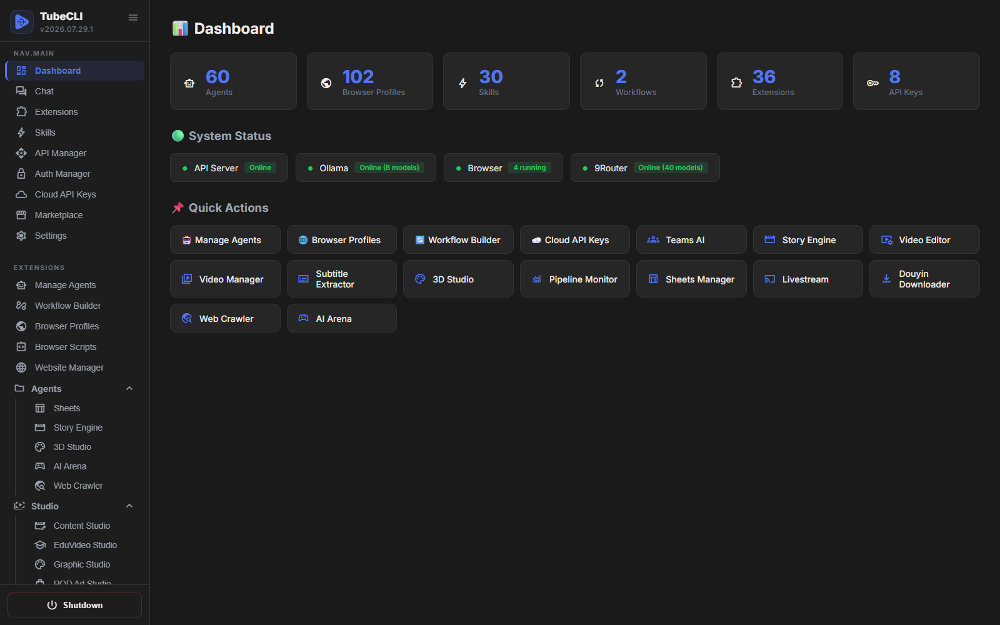

# TubeCLI — Self-Hosted AI Agent Team That Makes Videos, Drives Browsers, Deploys Sites and Works a Task Board

**Coding agents write code. This one runs the operations — on your machine, with your keys, for your clients.**

<p align="center">
  <b>English</b> |
  <a href="READMEs/README_zh-CN.md">简体中文</a> |
  <a href="READMEs/README_zh-TW.md">繁體中文</a> |
  <a href="READMEs/README_ja.md">日本語</a> |
  <a href="READMEs/README_ko.md">한국어</a> |
  <a href="READMEs/README_es.md">Español</a> |
  <a href="READMEs/README_tr.md">Türkçe</a> |
  <a href="READMEs/README_ru.md">Русский</a> |
  <a href="READMEs/README_vi.md">Tiếng Việt</a>
</p>

<p align="center">
  <a href="https://github.com/tubecreate/tubecli/stargazers"></a>
  <a href="https://github.com/tubecreate/tubecli/blob/main/LICENSE"></a>
  
  
  
  
</p>

**TubeCLI is a self-hosted, open-source AI agent team that executes real operational work end to end.** It is not a chat wrapper, and it is not a framework you have to code your agents into. You describe the job in plain language — from the CLI, the web dashboard, Telegram, or the Flow canvas on TubeCLI Cloud — and an agent team carries it out with real tools against your own machine, with your own keys.

*v2026.08.09.193 · Python 3.10+ / FastAPI / Node.js / Vue / Three.js · MIT*

---

## What's new (August – October 2026)

- **Narrated videos from what the agent read today.** `content_video` turns the agent's own corpus (articles it scraped, videos it watched, links you paste) into a script → storyboard → images → voice → mp4, queued on the Task Board. Aspect 16:9 or 9:16, any of nine languages, verbatim mode for scripts you wrote yourself, a content queue that feeds one video per item per day, resume-after-crash rendering, and optional auto-publish to YouTube with a generated thumbnail.
- **Canvas Engine in the core.** The scene renderer (layouts, word-timed subtitles, chalkboard and sketch templates, per-scene clips) now ships with TubeCLI and updates with it.
- **Codex GPT node.** The OpenAI Codex CLI runs on your machine, under TubeCLI: several ChatGPT subscriptions in one vault with automatic switching when a quota runs out, chat sessions managed from the Flow canvas, and an MCP server (`tubecli`) through which Codex drives the Task Board, browser profiles, extensions and the API.
- **Muse as a provider.** [muse.ai](https://muse.ai) (Meta's agent) has no API; TubeCLI drives its web app inside a signed-in browser profile and exposes it like any other provider — text, 16:9 / 9:16 images, 10-second image-to-video clips, several accounts in parallel.
- **More voices and images.** OmniVoice and EverAI voices, TTS VibeVoice (Edge fallback), CapCut TTS with word timings; one shared image core (`core/image_gen.py`) with Cloudflare FLUX, gpt-image, Gemini and Muse behind it, daily-quota key rotation and a "test this key" button.
- **Deliverables where you keep them.** Finished videos, per-scene clips, SRT subtitles, director boards and a Google Sheet of prompts go to your Google Drive; clone a finished video into another language with one click; retry a step with a different writing model, image model or voice.
- **TubeCLI Cloud and Agent Town.** Optional hosted canvas at [cloud.tubecreate.com](https://cloud.tubecreate.com): pair your own PC with a 6-character code (free), rent a VPS, or connect one you already have over SSH; watch browsers live; and publish your agents on [Agent Town](https://tubecli.app) where visitors chat with them and hire them — ad videos from product photos, Vietnamese "NĐ 30" Word formatting, remote browser sessions.
- **Your own PC as the server.** A one-file connect client installs TubeCLI if missing, keeps it running, holds a Cloudflare tunnel, sits in the tray and starts with the computer. Windows, macOS and Linux — including machines in mainland China via `install-cn.sh` and a GitHub proxy.
- **Operations.** Extensions update by hot reload without restarting TubeCLI; machines report CPU / RAM / disk to the cloud every 15 minutes; browser sessions recover from "already open" and out-of-memory states with a named reason instead of a silent close.

---

## What it actually does

### Make a video from today's reading

Tell the agent *"make a video from what you read today"* (or hand it links), and it files a task:

```json
{"action": "content_video_run", "aspect_ratio": "9:16", "language": "en", "target_words": 1500,
 "sources": ["https://example.com/article", "https://youtube.com/watch?v=..."],
 "publish": true, "publish_channel_name": "My Channel", "thumbnail": true}
```

What runs, in order, with every step on the Task Board and a resumable render: check that Content Studio has a text and an image provider (fail here, before spending anything) → read the agent's corpus for the day → fetch transcripts and crawl the extra links → write the script with the agent's model → storyboard with a Content Studio template → draw the images → read the narration (CapCut, VibeVoice, OmniVoice, EverAI or Edge voices) → render with the Canvas Engine → upload to Drive, and publish to YouTube if you said so. Paste your own text and the video reads it **verbatim**, the AI only describes the pictures.

### Deploy a real website from one sentence

Say it in chat or Telegram — *"create a website called coffee-shop using the coffee-machine template"* — and the website agent runs the entire chain against **your own** Cloudflare account, streaming every step to a live log:

```
[1/9] git clone --depth=1 -- <template>            → clone
[2/9] npm install
[3/9] wrangler d1 create + wrangler r2 bucket create
[4/9] wrangler d1 execute schema.sql --remote       → real remote database
[5/9] write wrangler.toml  (D1 + R2 bindings)
[6/9] npx @opennextjs/cloudflare build
[7/9] npx wrangler deploy                          → https://<site>.workers.dev
[8/9] seed the admin password you chose
[9/9] DEPLOY_RESULT {url, adminSeeded}
```

Every step is in [`deploy_runner.js`](tubecli/extensions/website_manager/deploy_runner.js) — read it before you trust it. **It is not one-click:** it needs valid Cloudflare credentials and D1 quota, and when a step fails it stops and names the step in the log rather than reporting a half-built site as finished.

### Subtitle, translate, dub and clone a video

```bash
tubecli skill run "Analyze Channel" --input "https://www.youtube.com/@channel"
tubecli skill run "Extract Subtitle" --input "<video-url-or-path>"
tubecli skill run "Translate Subtitle" --input "<job-id>"
```

Three interchangeable extraction engines — local Whisper, Gemini, or YouTube captions — exporting **SRT / JSON / VTT / ASS**. A finished TubeCLI video can be **cloned into another language** (new narration, same pictures) from its Task Board card. Burn-in and hardsub removal (ffmpeg `delogo`/blur/pixel/fill with OpenCV region detection) are implemented and reviewable, but treat them as experimental.

### Drive a real browser

Anti-detect browser profiles (ShardX engine on Linux/macOS, BAS on Windows), proxies and fingerprints per profile, a **Keychain** vault so the agent logs in without ever seeing your password, TOTP 2FA, YouTube cookies fetched from a running profile when a download needs them, and **Script Studio** for recorded step-by-step automations. On the Flow canvas you watch the browser live, type into it, and hand it to an agent — or let an agent run it headless on a schedule and peek in when you want.

### Keep a human in front of anything irreversible

An agent proposing something destructive does not just do it:

```bash
codex                  # list what is waiting
codex 3                # inspect task 3 — goal, assignee, step timeline
approve 3              # or:  reject 3
```

Tasks the AI creates land in `pending_approval` and wait. Deploying, publishing and deleting all pass through that gate, and every task keeps an append-only JSONL audit trail with step timings and retry counters.

### Run it from wherever you are

The same pipeline backs every surface — CLI, web dashboard, Telegram bot, and the Flow canvas on TubeCLI Cloud. Send a link to the bot and it replies with the finished file; approve a task from your phone; watch a render or a deploy log stream in the browser.

**Models:** every LLM call runs on local [Ollama](https://ollama.com) — no API key, no per-token cost — or on Gemini, OpenAI, Claude, DeepSeek, Grok, OpenRouter, Cloudflare Workers AI, a local 9Router endpoint, Muse (through a browser session) and the Codex CLI (your ChatGPT plan) with your own keys. Critical paths use zero-token fast paths that never call a model at all.

**Also included:** WordPress publishing over the WP REST API, web crawling and change watching, video download from 50+ platforms, Douyin/TikTok download, Google Sheets, Calendar and Drive, a shared media library, POD / graphic / content studios, and livestream restreaming.

---

## The dashboard

All of it is also driveable from a browser at `localhost:5295/dashboard` — agents, browser profiles, skills, workflows, extensions, API keys, the Task Board and the Codex GPT console in one place, with local Ollama and browser status live in the header and every installed studio in the sidebar.



---

## Why people pick it

- **"It generated a scaffold, not a website."** The deploy runner executes nine real steps against *your* Cloudflare account and does not stop until a URL answers. You can read every step in the repo. See the caveat above — it is real, not magic.
- **"I want the video, not a script for a video."** `content_video` ends with an mp4 on your Drive (and on your channel if you asked). Steps that fail say so on the card; a killed render resumes from the frames it already has.
- **"The framework is free, but I'm not allowed to resell it."** TubeCLI is MIT: multi-tenant deployment, white-labelling and reselling are all permitted. For contrast, n8n's Sustainable Use License forbids reselling it as a hosted service, and Dify's modified Apache license forbids operating a multi-tenant environment and forbids removing their logo. *(CrewAI, LangGraph and OpenHands are MIT too — this argument does not apply to them.)*
- **"My agent burned tokens deciding what to do."** Common flows are routed by zero-token fast paths — deterministic intent matching that never calls a model. The LLM is used where judgement is actually needed.
- **"I don't want my clients' credentials in someone else's cloud."** Everything runs on your hardware. Your keys stay in your own `data/` directory, social logins stay in the Keychain vault, and with local Ollama the system needs no external API at all.
- **"An agent did something irreversible."** The Codex queue gates it: AI-created tasks land in `pending_approval` and wait for a human before anything irreversible runs — deploy, publish, delete. Every task carries an append-only JSONL audit trail, and a running job can be cancelled mid-flight and restarted from the step it stopped at.

## 🌟 Key Features

- 💬 **Chat** — One conversation surface for the whole system: multi-session threads with durable history, an agent picker (or automatic routing), markdown rendering. Every turn runs the full pipeline — zero-token intent classification, skill selection, then the model — so anything the Telegram bot can do, the browser can do too.
- 📋 **Task Board (Codex)** — Mission control for agentic work. You or the AI create a task, delegate it to an agent or a team, approve it, and a background worker runs it while you watch the step timeline with progress, elapsed time and time left. Extensions register their own task types (a video, a queue item, a reup) with their own forms. Tasks survive a restart and carry a full audit trail.
- 🎬 **Content video pipeline** — Script → storyboard → images → voice → render → Drive → YouTube, from the agent's corpus or from text you paste. Content Studio templates decide language, voice, layout and length; a shared template library serves Content Studio and POD Studio alike.
- 🖼 **Canvas Engine** — The renderer behind "explainer" videos: scene layouts, word-timed subtitles (`.ass`), chalkboard / sketch / watercolor kits, per-scene clean clips, 16:9 and 9:16.
- 🧠 **Codex GPT** — Codex CLI managed by TubeCLI: multiple ChatGPT subscriptions with automatic failover, sessions in the Flow canvas, and the `tubecli` MCP server so Codex can operate TubeCLI itself.
- 🎨 **Muse provider** — Text, images and 10-second clips from muse.ai through a signed-in browser profile; several accounts run in parallel lanes.
- 🤖 **Agent Manager** — Agents with personas, routines, skills, per-agent thresholds (busy / tired / quota warnings) and a public mode for Agent Town.
- ⚡ **Skill System** — Executable workflows marked with tags (Workflow, API, Markdown) with a Markdown viewer and a real-time execution modal.
- 🔄 **Workflow Engine & Builder** — DAG-based executor with a node-based builder in the WebUI; the Flow canvas on TubeCLI Cloud adds live browser, agent, extension, Codex and file nodes.
- 👥 **Teams Agents** — Orchestrate agents with organizational charts; delegation routes work sequentially, in parallel, or hierarchically.
- 🏢 **3D Studio & Story Engine** — Isometric procedural 3D teams and interactive 3D stories (Three.js).
- 🌐 **Browser Automation** — Profiles, proxies, fingerprints, Keychain logins, TOTP 2FA, Script Studio, live view, headless scheduled runs, orphan and out-of-memory recovery.
- 🔐 **Keychain** — Your social-media logins in a Fernet-encrypted vault; browser profiles use them, agents never read them.
- 📚 **Media Library** — One bag of images, GIFs and videos every extension can draw from.
- 🔌 **Extension Manager** — Pluggable architecture; each extension contributes CLI commands, API routes, workflow nodes, Telegram actions, task types and its own UI page. Updates hot-reload.
- 🛒 **Marketplace** — Install studios and skills from the registry in one click, and publish your own templates.
- 📨 **Telegram Bridge** — Intent routing, skill execution, task approval and notifications from a bot.
- ☁️ **TubeCLI Cloud** *(optional)* — Hosted Flow canvas, pairing for your own PC, VPS rental, SSH connect, metrics, and Agent Town.

## 🧩 What ships in the repo

**26 built-in extensions** (`tubecli/extensions/`):

| Extension | What it does |
|---|---|
| `chat` | Conversation surface and the intent → skill → model pipeline |
| `codex` | Task Board: durable queue, approval gate, background worker, audit trail |
| `codex_gpt` | Codex CLI under TubeCLI: subscriptions vault, sessions, `tubecli` MCP server |
| `content_video` | Narrated video from the agent's corpus or pasted text, as a task |
| `content_queue` | Keyword + text items, one video each, with a daily cap |
| `canvas_engine` | Scene renderer: layouts, subtitles, templates, per-scene clips |
| `capcut_tts` | CapCut voices with word timings, account pool |
| `media_library` | Shared raw material (images, GIFs, videos) |
| `browser` | Anti-detect profiles, proxies, fingerprints, live view, Muse driver |
| `browser_scripts` | Script Studio: visual step-by-step browser automations |
| `keychain` | Encrypted vault for the user's social logins |
| `auth_manager` | OAuth credentials and tokens for Google, Facebook, TikTok |
| `website_manager` | Cloudflare Workers deploy runner, site records, WordPress publishing |
| `video_studio` | Subtitle extraction / translation, channel analysis, approval-gated reup |
| `video_downloader` | yt-dlp with self-install and self-update, cookies from a running profile |
| `video_editor` | FFmpeg trimming, merging, overlays, export |
| `douyin_downloader` | Douyin / TikTok download with direct video links |
| `universal_tracker` | Watches YouTube, Douyin and websites for new posts and runs team workflows |
| `multi_agents` | Teams, org charts, delegation strategies |
| `cloud_api` | Provider keys: Gemini, OpenAI, Claude, DeepSeek, Grok, OpenRouter, Cloudflare, 9Router, Muse |
| `ollama_manager` | Local models with no API key |
| `market` | Marketplace client: install, update, publish |
| `calendar_manager` | Google Calendar events, recurrence, reminders |
| `file_manager` | Files and folders on the machine, Google Drive, share links |
| `studio3d` | 3D teams and story player |
| `webui` | The dashboard itself |

**Marketplace studios** (install from the dashboard): Content Studio, EduVideo Studio, POD Ad Studio, Thumbnail Studio, Web Crawler, Subtitle Extractor, TTS VibeVoice, Sheets Manager, Video Manager, Browser Scripts, AI Arena, livestream, and more.

## ☁️ TubeCLI Cloud and Agent Town

TubeCLI runs fine on its own. [TubeCLI Cloud](https://cloud.tubecreate.com) is an optional hosted layer in front of it:

- **Flow canvas** — a shared workspace of nodes: browser profiles you watch live, agents, extensions, the Task Board, Codex GPT sessions, files and sheets. A guided start for newcomers picks the AI model, installs the studios, checks ffmpeg and voices, and creates the first task.
- **Three ways to add a machine** — *Connect my computer* (free: a pairing code and one line to paste; the open-source client in [`client/tubecli_connect.pyw`](client/tubecli_connect.pyw) installs TubeCLI, starts it and holds a Cloudflare tunnel), *Rent a server* (we host it, monthly), or *Connect my VPS* (we install over SSH on a Linux box you own).
- **[Agent Town](https://tubecli.app)** — publish an agent and visitors chat with it, hire it for ad videos from their product photos, Word formatting to Vietnamese decree NĐ 30, or a remote browser session, and pay in credits. The machine reports progress with HMAC-signed telemetry; the owner always approves what runs.

The cloud never holds your keys or your browser sessions; it reaches your machine only through the tunnel you opened.

## 🚀 Quick Start & Installation

### Option 1: One-Click Auto Install (Recommended for Users)
**For Windows:** Open **PowerShell** and paste the following command:
```powershell
powershell -c "irm https://raw.githubusercontent.com/tubecreate/tubecli/main/install.ps1 | iex"
```
*To install with a specific language (e.g. `vi`, `zh-TW`, `ja`):*
```powershell
powershell -c "&([ScriptBlock]::Create((irm https://raw.githubusercontent.com/tubecreate/tubecli/main/install.ps1))) -Lang vi"
```

**For Linux / macOS:** Open your terminal and run:
```bash
curl -fsSL https://raw.githubusercontent.com/tubecreate/tubecli/main/install.sh | bash
```
*With a specific language:*
```bash
curl -fsSL https://raw.githubusercontent.com/tubecreate/tubecli/main/install.sh | bash -s -- --lang vi
```

**Mainland China (Linux server):** `raw.githubusercontent.com` is reset there, so use the China installer through a GitHub proxy — it also switches Node, npm and pip to local mirrors and fetches `cloudflared` through the proxy:
```bash
curl -fsSL https://gh-proxy.com/https://raw.githubusercontent.com/tubecreate/tubecli/main/install-cn.sh | bash
```
On Windows and macOS in China, pass the proxy to the normal installers: `install.ps1 -RepoUrl https://gh-proxy.com/https://github.com/tubecreate/tubecli.git`, or `TUBECLI_REPO_URL=https://gh-proxy.com/https://github.com/tubecreate/tubecli.git` for `install.sh`. TubeCLI Cloud prints the right line for you when you switch on *Mainland China network*.

The installer adds Python, Git and Node.js if missing, clones the repo, and sets everything up from A to Z.

**On a server (VPS):** the same command detects that there is no display and finishes as a server — it asks for a dashboard password (Enter keeps the default `123456`; the dashboard then insists you change it), installs a systemd service so TubeCLI survives SSH logout and reboots, and prints the URL to open from your own computer. Re-running the same command later **updates** the install; the dashboard also has a one-click *Update* button. Useful afterwards:
```bash
tubecli info        # re-print the URL / password status / commands screen
tubecli password    # change the dashboard password
tubecli service logs -f
```

### Option 2: Manual Installation (For Developers)

#### Prerequisites
- Python 3.10+
- Git
- Node.js 18+ and ffmpeg (the installers add them; the browser engine, Canvas Engine and Codex GPT need Node)
- Ollama (optional, for local models)

#### 1. Clone & Install
```bash
git clone https://github.com/tubecreate/tubecli.git
cd tubecli
python3 -m venv .venv && . .venv/bin/activate   # macOS / Linux
pip install -e .
```

#### 2. Initialize Workspace
`init` sets up the `data/` directory, extracts default skills, activates core extensions and configures the port. On first run it also walks you through picking an AI model.
```bash
tubecli init --lang en --port 5295
```
It then hands over to an interactive control panel, which starts the API server for you and stays in the foreground — press `1` to open the dashboard. This is the normal way to run TubeCLI day to day.

#### 3. Or run it as a server
On a headless machine (VPS, no display) `tubecli init` skips the control panel automatically and finishes as a server: password, systemd service, and a summary with the URL. You can also force either ending:
```bash
tubecli init --server   # password + systemd service + summary, then exit
tubecli init --panel    # the interactive control panel, even on a server
tubecli init --no-menu  # plain setup and exit (Dockerfile / CI; then run `tubecli api start`)
```

On a desktop the dashboard is at **http://localhost:5295/dashboard**; on a server replace `localhost` with the machine's public IP (and open TCP 5295 in your provider's firewall). `tubecli info` prints the exact URL block any time.

### Option 3: Pair your own computer with TubeCLI Cloud
Open [cloud.tubecreate.com → Connect my computer](https://cloud.tubecreate.com/dash/connect/local), pick your system and get a pairing code. The page gives you one line to paste; this is what it does on Windows:
```powershell
powershell -c "irm https://raw.githubusercontent.com/tubecreate/tubecli/main/client/tubecli_connect.pyw -OutFile $env:TEMP\tubecli_connect.pyw; pythonw $env:TEMP\tubecli_connect.pyw --code=XXXXXX"
```
The client (one file, standard library only) installs TubeCLI if it is missing, starts it on port 5295, opens a Cloudflare tunnel to `<name>.tubecreate.com`, sits in the tray and starts with the computer. Already installed by hand? Pair with the client that is in the repo: `python client/tubecli_connect.pyw --code=XXXXXX`. To remove it: tray icon → Quit, then delete `~/TubeCLI` (Windows) or `~/tubecli` and the config folder. Nothing is charged for your own machine.

## 💻 CLI Usage

Manage the entire system directly from the terminal if you prefer a headless approach:

### Agent Management
```bash
tubecli agent create "My Assistant" --description "General purpose AI agent"
tubecli agent list
tubecli agent show <id>
tubecli agent delete <id>
```

### Skill Execution
```bash
tubecli skill list
tubecli skill run "AI Summarizer" --input "Long text content..."
```

### API & Workflows
```bash
tubecli api start --port 5295
tubecli api stop
tubecli workflow run <path_to_workflow.json>
```

### Optional Parallel web search

The `web_search` workflow node can use [Parallel Search MCP](https://docs.parallel.ai/integrations/mcp/search-mcp)
for free web search with source URLs and excerpts, powered by Fast mode. No account
or API key is needed. From your TubeCLI checkout, install the optional dependency
and run the example:

```bash
pip install -e '.[parallel-search]'
tubecli workflow run examples/parallel-search.json --input "Python asyncio documentation"
```

Set `"provider": "parallel"` in a `web_search` node's `config` to use it in your
own workflow. Existing workflows keep the DuckDuckGo/Google fallback chain.
The anonymous service has rate limits; Parallel failures are reported in the
node's status without switching providers. Each search has a 30-second timeout.
This adapter exposes search only, not the MCP server's page-fetching tool.

### Task Board (Codex)
```bash
tubecli codex create "Research the top 5 competitor channels" --agent "Researcher"
tubecli codex list --status pending_approval
tubecli codex approve 3
tubecli codex show 3
```
> Tasks the AI creates always wait for your approval before they run.

### Extensions & Market
```bash
tubecli extension list
tubecli extension enable webui
tubecli market search "seo"
tubecli market install "seo-analyzer"
```
> Extensions installed or updated from the dashboard hot-reload. Extensions you drop into the folder by hand bind their routes when the server imports them, so **restart the server** after adding one that way.

## How TubeCLI compares

TubeCLI column measured 2026-10-09; competitor columns were last checked 2026-07-30 and may have moved. Rows where TubeCLI loses are marked plainly — if you need those, use one of the others.

| | **TubeCLI** | n8n | Dify | CrewAI | LangGraph | OpenHands |
|---|---|---|---|---|---|---|
| What it sells | Work already finished | Workflow platform | Agentic workflow builder | Agent framework | Low-level orchestration | Coding-agent control center |
| License | **MIT** | Sustainable Use | Modified Apache | MIT | MIT | MIT |
| Resell as a hosted service | **Yes** | **No** | **No** | Yes | Yes | Yes |
| Multi-tenant / white-label | **Yes** | **No** | **No** (logo must stay) | Yes | Yes | Yes |
| Self-host | Yes | Yes | Yes | Yes | Yes | Yes |
| Local LLM first-class (Ollama) | **Yes** | Partial | Partial | Via config | Via config | Partial |
| Zero-token fast paths | **Yes** | n/a | No | No | No | No |
| Makes a finished narrated video (script → images → voice → mp4 → YouTube) | **Yes** | No | No | No | No | No |
| Deploys a site to Cloudflare Workers end-to-end | **Yes** (see caveat) | No | No | No | No | No |
| Crawl → draft with an LLM → publish to WordPress | **Yes** | Build it yourself | Build it yourself | Build it yourself | Build it yourself | No |
| Subtitle extract + translate (3 engines, SRT/VTT/ASS) | **Yes** | No | No | No | No | No |
| Browser automation with live view, Keychain logins, TOTP 2FA | **Yes** (2FA flaky) | Via nodes | No | No | No | No |
| Human approval gate on irreversible steps | **Yes, enforced** | Manual | No | No | Build it yourself | Partial |
| Telegram as a control plane | **Yes** | Via nodes | No | No | No | No |
| No-code visual builder | Partial — workflow builder in the dashboard, Flow canvas on TubeCLI Cloud | **Yes** | **Yes** | No | No | Partial |
| MCP support | Partial — ships an MCP **server** (`tubecli`) for the Codex CLI; no generic MCP client | **Yes** | **Yes** | **Yes** | **Yes** | **Yes** |
| Prebuilt integrations | 26 built-in + marketplace studios | **400+** | Large | Large | Large | Large |
| Managed cloud option | Optional (TubeCLI Cloud) | **Yes** | **Yes** | **Yes** | **Yes** | **Yes** |
| Enterprise support / SSO / audit | **No** | **Yes** | **Yes** | **Yes** | **Yes** | Partial |
| Battle-tested at scale | **No — early** | **Yes** | **Yes** | **Yes** | **Yes** | **Yes** |

**Caveat on Cloudflare deploys:** real but not one-click — it needs valid Cloudflare credentials and D1 quota, and admin-password seeding can fall back to the template default. Failures stop and name the failing step instead of reporting success.

**Where TubeCLI honestly loses:** no generic MCP client, a thinner no-code builder than n8n or Dify, no enterprise SSO/audit product, and far fewer integrations than n8n's 400+. It is early software.

**Where the license comparison does *not* apply:** CrewAI, LangGraph and OpenHands are MIT too — the resale argument only beats n8n, Dify and AutoGPT's platform. Against CrewAI and LangGraph the difference is that they hand you building blocks, while TubeCLI hands you a `wrangler deploy` that already ran and an mp4 that is already on your Drive.

## FAQ

### What is TubeCLI?
TubeCLI is a self-hosted, open-source AI agent team that executes operational work end to end — making narrated videos from what the agent read, deploying websites to Cloudflare Workers, crawling the web and publishing to WordPress, extracting and translating video subtitles, and automating browsers. It ships 26 built-in extensions plus marketplace studios, and runs from the CLI, a web dashboard, Telegram, or the Flow canvas on TubeCLI Cloud.

### Is TubeCLI free?
Yes. MIT licensed, no paid tier, no seat limits, no credit meter. You may run it for paying clients, multi-tenant and white-labelled, without asking permission. Your only costs are your own infrastructure and whatever LLM you point it at — which can be $0 if you use local Ollama. TubeCLI Cloud is a separate, optional hosted service; pairing your own computer with it is free.

### Does TubeCLI need an API key?
No. Point it at local [Ollama](https://ollama.com) and it runs with no API key and no per-token cost. If you prefer cloud models it supports Gemini, OpenAI, Claude, DeepSeek, Grok, OpenRouter and Cloudflare Workers AI with your own keys, a local 9Router endpoint, Muse through a signed-in browser profile, and the Codex CLI with your ChatGPT plan. Note that the shipped default is a cloud model, so switch the default to Ollama if you want fully local operation.

### Can it really make a video by itself?
Yes, as a task you can watch and stop. `content_video` writes the script from the agent's corpus (or reads your text verbatim), storyboards it with a Content Studio template, draws the images, reads the narration, renders with the Canvas Engine and uploads the result — to YouTube too if you asked, with a generated thumbnail. It needs Content Studio installed with a text and an image provider, ffmpeg, and a voice; `content_video_capabilities` lists exactly what is missing before anything is spent. A render that was killed resumes from the frames it already has.

### What is the Codex GPT node, and how is it different from the Task Board?
The Task Board (`codex`) is TubeCLI's own queue of tasks for its agents. Codex GPT (`codex_gpt`) is OpenAI's Codex CLI running on your machine under TubeCLI's management: a vault of several ChatGPT subscriptions that switch automatically when one runs out of quota, chat sessions you manage from the Flow canvas, and an MCP server named `tubecli` through which Codex can read the Task Board, open browser profiles, install extensions and call the API — with changes still waiting for the owner's approval.

### Can TubeCLI actually deploy a website?
Yes, genuinely — not a scaffold. Its deploy runner performs `git clone` → `npm install` → `wrangler d1 create` + `r2 bucket create` → remote schema apply → OpenNext build → `wrangler deploy` against your own Cloudflare account, and you can read the whole runner in this repo before trusting it. It is **not** one-click: it needs valid Cloudflare credentials and D1 quota, and admin seeding can leave the template default password. When something fails it stops and names the failing step in the log instead of reporting a half-built site as finished.

### How is TubeCLI different from LangChain, CrewAI, or AutoGPT?
Those give you building blocks to construct an agent; you still write the supervisor, the deploy step, and the publishing step yourself. TubeCLI ships the finished tools — a video pipeline that ends with an mp4 on your Drive, a Cloudflare deploy runner, a WordPress publisher that speaks WP REST with app-password auth, a three-engine subtitle pipeline. You operate it rather than program it.

### Is TubeCLI a self-hosted Manus alternative?
For operational tasks, yes — both aim at an agent that uses real tools rather than returning code. The differences that matter: TubeCLI runs on your hardware, has no credit meter, is MIT so you can resell it, and can run entirely on a local model. It is far less polished and far less battle-tested than a funded hosted product.

### Can I run TubeCLI for my clients and charge for it?
Yes, and this is a deliberate differentiator. MIT permits multi-tenant deployment, white-labelling, and reselling. For contrast: n8n's Sustainable Use License forbids reselling it as a hosted service, and Dify's modified Apache license forbids operating a multi-tenant environment and forbids removing their logo. Agent Town goes one step further: publish your agent there and visitors hire it directly.

### Does TubeCLI support MCP?
Partially. The repo ships an MCP **server** (`tubecli/extensions/codex_gpt/mcp_relay.py`, registered as `tubecli` in the Codex CLI's `config.toml`) that exposes the Task Board, browser profiles, extensions and the API to Codex. The optional Parallel search adapter consumes one remote MCP service through the `web_search` node. There is no generic MCP client for arbitrary third-party servers; if that is a requirement, use n8n, Dify, CrewAI or LangGraph instead.

### Can TubeCLI translate and burn subtitles?
Extraction and translation are the mature part: three interchangeable engines (local Whisper, Gemini, YouTube CC) exporting SRT/JSON/VTT/ASS, with translation as a separate step so you can review the text before it is burned anywhere. Finished TubeCLI videos can be cloned into another language. Burn-in and hardsub removal (ffmpeg delogo/blur/pixel/fill with OpenCV region detection) are implemented and reviewable but should be treated as experimental.

### How do I stop an agent from doing something irreversible?
The Codex queue gates it. AI-created tasks land in `pending_approval` and wait for a human to accept or reject before anything irreversible runs — deploying, publishing, deleting. Review it with `codex 3`, then `approve 3` or `reject 3`. Every task carries an append-only JSONL audit trail with step timings and retry counters, and a running job can be cancelled mid-flight.

### Is TubeCLI production-ready?
Parts of it are. Browser automation, subtitle extraction and translation, WordPress publishing, the content video pipeline and the Task Board are in daily use. Cloudflare deploys work but need supervision. The full video reup chain, subtitle burn-in, Muse video clips and multi-agent org-chart delegation are implemented but should be treated as experimental. Treat it as capable early software with an honest changelog, not as enterprise infrastructure.

## 🧠 Architecture Overview

```
tubecli/
├── tubecli/           # Main package
│   ├── api/           # REST API server (FastAPI) + Codex GPT and Muse routes
│   ├── cli/           # CLI command modules
│   ├── core/          # Core business logic: brain, image_gen, muse, telegram, net_mirror…
│   ├── extensions/    # 26 built-in extensions (each with its own SKILL.md or README)
│   ├── nodes/         # Workflow node implementations
│   └── skills/        # Built-in system skills
├── client/            # tubecli_connect.pyw — pairing client for TubeCLI Cloud (one file)
├── install.sh / install.ps1 / install-cn.sh
├── READMEs/           # Translated documentation (8 languages)
├── docs/              # Project website
├── data/              # Runtime DB & state (gitignored)
└── tests/             # Test suite
```

## 📖 AI-Readable Documentation

TubeCLI is designed so that an AI agent can understand and operate it without a human walkthrough:

- **`llms.txt`** at the repository root — a compact, machine-readable map of what the system is, what it can do, and what it explicitly cannot do.
- **`SKILL.md` inside every extension** (`tubecli/extensions/*/SKILL.md`) — endpoints, parameters, trigger commands and worked examples, written for LLMs rather than humans.
- **`SKILL_EXTENSION_BUILDER.md`** — how to write your own extension or skill.
- **The `tubecli` MCP server** — lets a Codex CLI session read the Task Board and operate the machine with the owner's approval.

External agents (Claude, GPT, Gemini, Codex) can read these files to learn how to drive the system, write extensions, and debug workflows autonomously.

## 📝 License

[MIT](LICENSE) — you may use, modify, self-host, white-label and resell this software, including for paying clients. Made with 🤖 by the TubeCreate Team.
